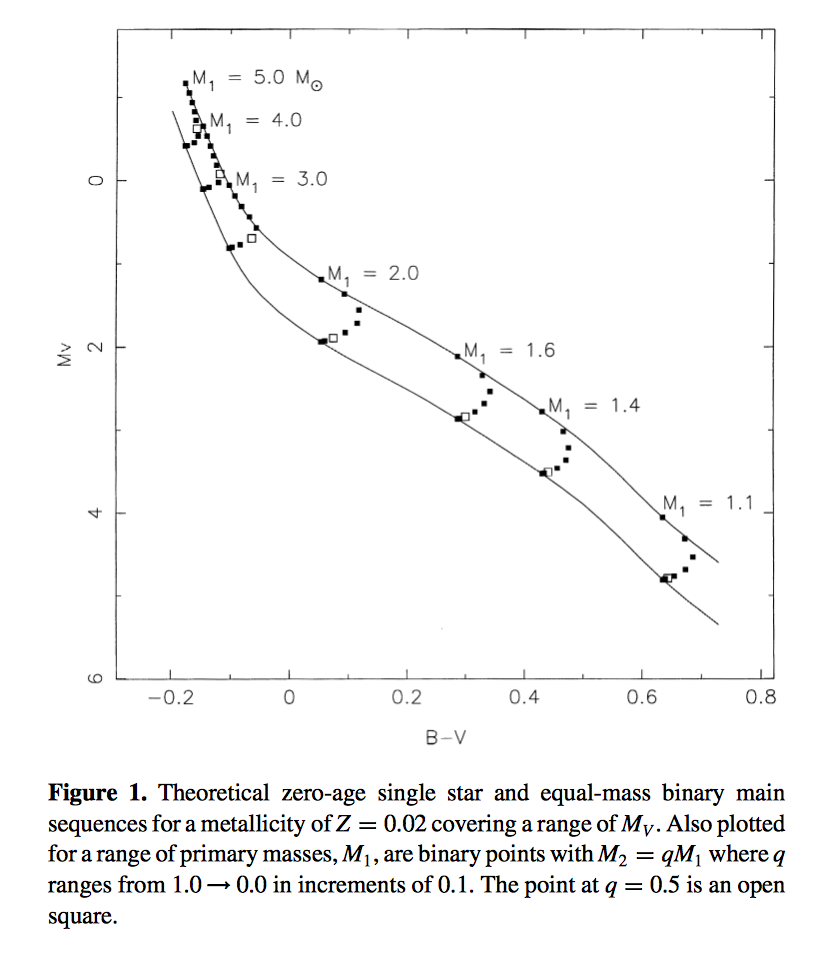

# Gaia *Unresolved*
Can we build a data-driven model of the binary fraction and binary mass ratio distribution for stars? Use the unresolved binaries from Gaia to infer the fraction and mass ratio distribution for the field.

## How
- detect as displacements from the stellar main sequence in the Color vs Absolute Magnitude diagram (CMD)
- use stellar models to convert CMD (B-V, M_V) to mass & mass ratio (M_1, *q*)
  - unless @ixkael, @andersdot, and @davidwhogg think it can be done w/o stellar models...
- model fraction of binary stars (*f*) and mass ratio distribution (*q*) as function of primary mass (M_1)
- try to do it independent of star formation history (SFH)!
- can we do it independent of the initial mass function (IMF)?

My thinking is calibrated on this figure from [Hurley & Tout (1998)](http://adsabs.harvard.edu/abs/1998MNRAS.300..977H)

## Assumptions
- Stars are either singles or doubles
- all stars are main sequence (dwarfs)

## Thoughts
- Binaries with mass ratios closer to *q*=1 are of course easier to detect
- need to model as fraction of binaries and single stars at each mass
- We *should* see the equal-mass (parallel) main sequence in Gaia field data, as is seen in many Open Clusters at ~0.75 mag brighter
- **Cheesy:** Can we find any sign of a THIRD main sequence from equal-mass tripples (~1.2 mag brigher)?
